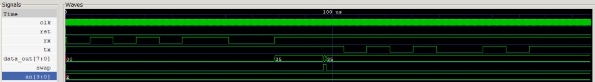
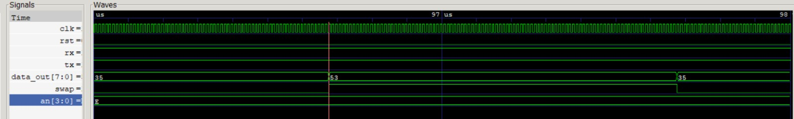
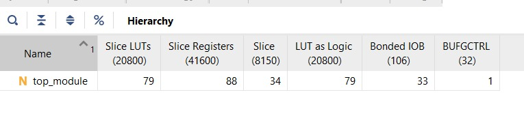
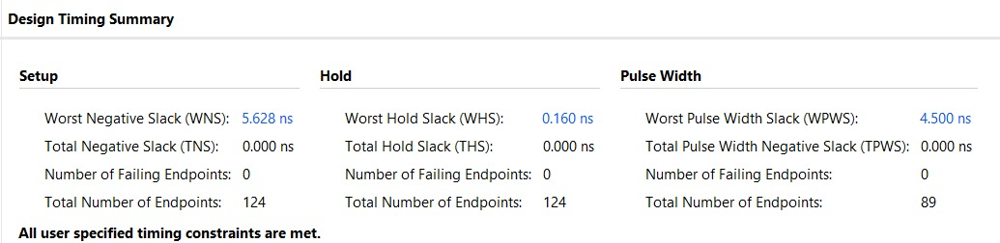

# UART Protocol Implementation on FPGA

A full-duplex **UART (Universal Asynchronous Receiver Transmitter)** written in Verilog HDL and deployed on a **Digilent Basys 3** (Artix-7 XC7A35T) using Xilinx Vivado. The design talks to a PC terminal over the board's USB-UART bridge at **115200 baud, 8N1**.

Bytes sent from the PC are shown in binary on the LEDs and in decimal on the four-digit seven-segment display. A byte chosen on the board's switches can be sent back to the PC with a button press.



---

## Features

- UART transmitter (FSM based, LSB first)
- UART receiver with 16x oversampling
- 115200 baud, 8 data bits, no parity, 1 stop bit
- PC to FPGA: received byte on 8 LEDs and as a decimal number on the 7-segment display
- FPGA to PC: transmit the byte set on the switches with one button press
- Nibble swap option (`swap`) that exchanges the upper and lower 4 bits of the received byte
- Self-checking testbench with PASS/FAIL summary and VCD waveform dump
- Timing closed at 100 MHz, small footprint (see [Results](#results))

---

## Hardware and Software

| Hardware | Software |
|---|---|
| Basys 3 FPGA board (XC7A35T) | Xilinx Vivado (synthesis, implementation, bitstream) |
| On-board USB-UART bridge | PuTTY or any serial terminal |
| 4-digit seven-segment display | GTKWave (viewing the VCD waveform) |
| On-board LEDs, switches, push button | Python script for UART monitoring |

---

## UART Configuration

| Parameter | Value |
|---|---|
| System clock | 100 MHz |
| Baud rate | 115200 |
| Data bits | 8 |
| Parity | None |
| Stop bits | 1 |
| Bit order | LSB first |

**Timing derivation**

- **Transmitter:** 100 MHz / 115200 is about 868 clocks per bit. `tx_baud_gen` produces one enable pulse every 868 clocks.
- **Receiver:** the receiver runs at 16x oversampling. `baud_rate_gen` produces one tick every 54 clocks (about 1.852 MHz, roughly 0.46% from the ideal 1.8432 MHz), and each bit is 16 ticks long.

---

## System Architecture

```text
                 RX path  (PC -> FPGA)
 PC Terminal --> UART Receiver --> LED Controller --> BCD Converter --> 7-Segment Display
 (rx pin)        (FSM + rx_enb)    (store + swap)     (double dabble)    (multiplexed)
                      ^
                 Baud Rate Gen (16x)


                 TX path  (FPGA -> PC)
 Switches + BTNU --> Edge detect --> UART Transmitter --> PC Terminal
 (8-bit data_in)     (tx_wr pulse)   (FSM + tx_en)        (tx pin)
                                          ^
                                     TX Baud Gen (115200)
```

### Module overview

| Module | Role |
|---|---|
| `top_module` | Connects all blocks, rising-edge detect on the transmit button |
| `baud_rate_gen` | Generates the 16x oversampling tick for the receiver |
| `receiver` | FSM that detects the start bit, samples 8 data bits, checks the stop bit, pulses `rdy` |
| `led_ctrl` | Latches the received byte and optionally swaps its nibbles |
| `bcdconvertor` | Converts the 8-bit value to BCD using the shift-and-add-3 (double dabble) method |
| `display` | Time-multiplexes the four digits using a refresh counter |
| `sevenseg` | Decodes a BCD digit to the active-low segment pattern |
| `tx_baud_gen` | Generates one enable pulse per bit period (868 clocks) |
| `transmitter` | FSM: IDLE, START, DATA, STOP |

---

## Working Principle

### PC to FPGA

1. A character is sent from the terminal.
2. The receiver detects the start bit and samples each data bit.
3. After a valid stop bit the byte is passed on with a `rdy` pulse.
4. `led_ctrl` stores the byte, and it appears in binary on the LEDs.
5. The BCD converter and display driver show its decimal value on the seven-segment display.

Example: pressing `5` in the terminal sends ASCII `0x35`, so the LEDs show `00110101` and the display shows `53`. With `swap` high the output becomes `0x53`, and the display shows `83`.

### FPGA to PC

1. Set an 8-bit value on the data switches.
2. Press the transmit button (`btnu`). A single-clock `tx_wr` pulse is generated on its rising edge.
3. The transmitter loads the byte and sends start bit, 8 data bits (LSB first), then stop bit.
4. The character appears in the PC terminal.

---

## I/O Summary

| Signal | Direction | Function |
|---|---|---|
| `clk` | in | 100 MHz system clock |
| `rst` | in | Synchronous reset |
| `rx` | in | UART receive line from the USB-UART bridge |
| `tx` | out | UART transmit line to the USB-UART bridge |
| `data_in[7:0]` | in | Byte to transmit |
| `btnu` | in | Transmit trigger |
| `swap` | in | Swap upper and lower nibble of the received byte |
| `data_out[7:0]` | out | Received byte (LEDs) |
| `seg[6:0]`, `an[3:0]` | out | Seven-segment display |

Pin assignments are in the [`Constraint file`](Constraint%20file) folder.

---

## Simulation

The testbench `tb_top_module` runs three self-checking tests:

| Test | What it does | Expected |
|---|---|---|
| 1. RX path | Sends `0x35` into `rx` | `data_out == 0x35` |
| 2. Nibble swap | Sets `swap = 1` | `data_out == 0x53` |
| 3. TX path | Sets `data_in = 0xA5`, pulses `btnu`, decodes `tx` | Decoded byte is `0xA5` |

It prints a PASS/FAIL line per check and a summary at the end, and writes `uart_system.vcd` for GTKWave.

### Simulation output

**Full run:** 0x35 received, swap pulse, then 0xA5 transmitted on `tx`.


**Zoom at about 97 us:** raising `swap` turns `0x35` into `0x53`, and releasing it restores `0x35`.



---

## Results

### Utilization (post-implementation, XC7A35T)

| Resource | Used | Available |
|---|---|---|
| Slice LUTs | 79 | 20,800 |
| Slice registers | 88 | 41,600 |
| Slices | 34 | 8,150 |
| Bonded IOB | 33 | 106 |
| BUFGCTRL | 1 | 32 |



### Timing (100 MHz)

| Metric | Value |
|---|---|
| Worst negative slack (setup) | 5.628 ns |
| Worst hold slack | 0.160 ns |
| Worst pulse width slack | 4.500 ns |
| Failing endpoints | 0 |

All user-specified timing constraints are met.



---

## Repository Structure

```text
UART-Protocol-Implementation-on-FPGA/
├── design files/        Verilog source for the UART system
├── SimulationFile/      Testbench
├── SimulationOutput/    Waveform screenshots
├── Reports/             Vivado utilization and timing reports
├── Constraint file/     Basys 3 XDC constraints
├── LICENSE
└── README.md
```

| File | Description |
|---|---|
| `top_module.v` | Top-level module |
| `transmittor.v` | UART transmitter |
| `receiver.v` | UART receiver |
| `baud_rate_gen.v` | Receiver baud (16x) generator |
| `tx_baud_gen.v` | Transmitter baud generator |
| `led_ctrl.v` | Stores received data, optional nibble swap |
| `display_unit.v` | Display multiplexer |
| `seg7_display.v` | 7-segment decoder |
| `FPGA_UART_conversion.py` | Python UART monitor |
| `tb_top_module.v` | Self-checking testbench |

---

## How to Run

### Simulation

1. Open Vivado and create a project for the XC7A35TCPG236-1.
2. Add the files from `design files/` as design sources and the testbench from `SimulationFile/` as a simulation source.
3. Set `tb_top_module` as the top simulation module and run behavioral simulation.
4. Check the Tcl console for the PASS/FAIL summary, or open `uart_system.vcd` in GTKWave.

### On hardware

1. Add the XDC from `Constraint file/` as a constraint source.
2. Run synthesis, implementation and generate the bitstream.
3. Program the Basys 3 over USB.
4. Open PuTTY with the board's COM port: **115200 baud, 8 data bits, no parity, 1 stop bit, no flow control**.
5. **PC to FPGA:** type a character. The LEDs show its ASCII code and the display shows it in decimal.
6. **FPGA to PC:** set the data switches and press the transmit button. The character appears in the terminal. Values above `0x7F` (for example `0xA5`) are not plain ASCII, so the terminal may show a symbol or replacement character.

---

## Applications

- Serial communication between a PC and an FPGA
- FPGA communication interfaces
- Embedded systems and debugging links

---

## Future Improvements

- Configurable baud rate
- UART echo functionality
- Parity and framing error detection
- FIFO buffering for received and transmitted data
- Input synchronizers and button debouncing

---

## Author

**Cherukuri Shyam Sundhar**

Electronics and Communication Engineering

IIT Bhubaneswar

---
